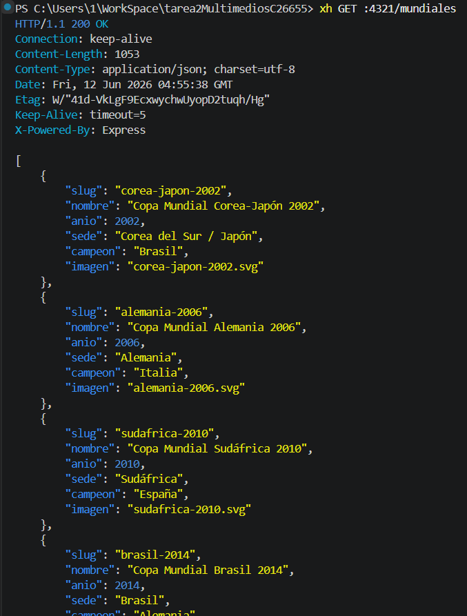
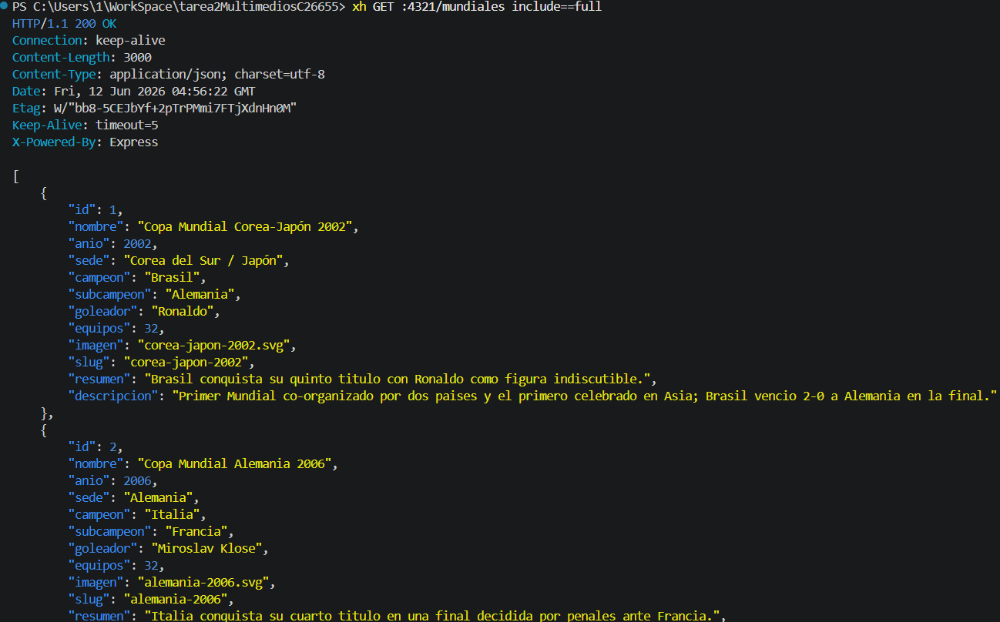
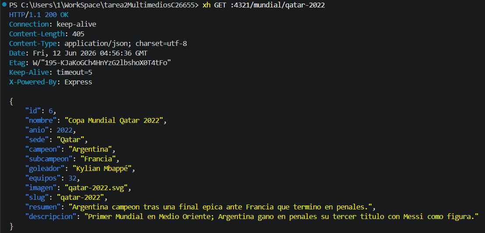
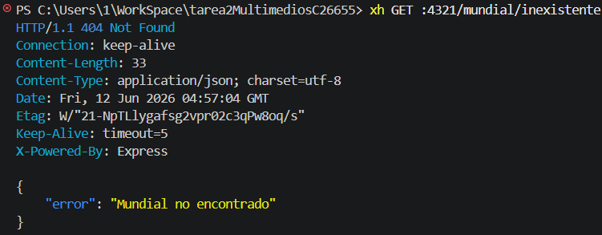
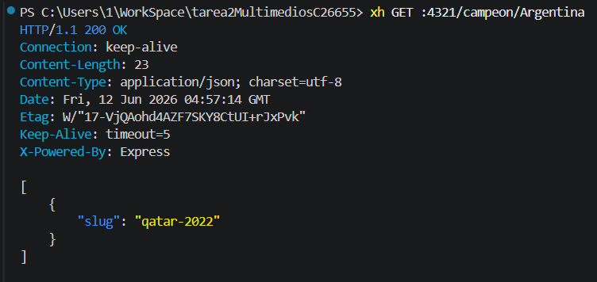
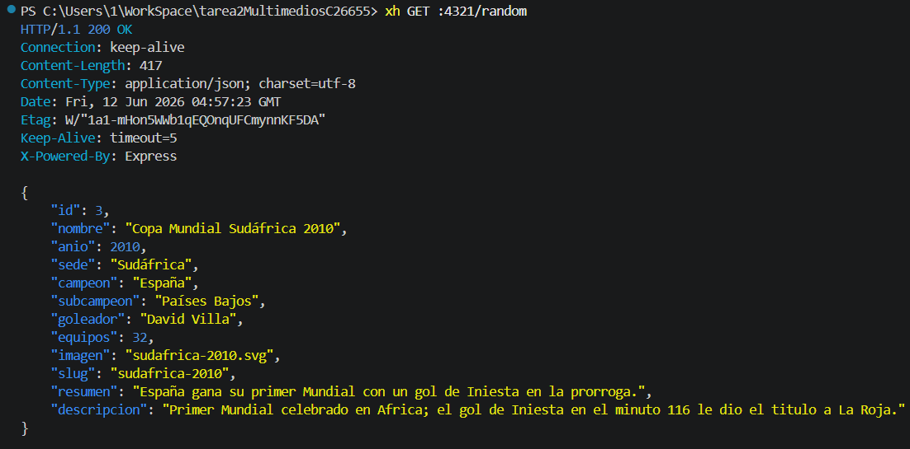
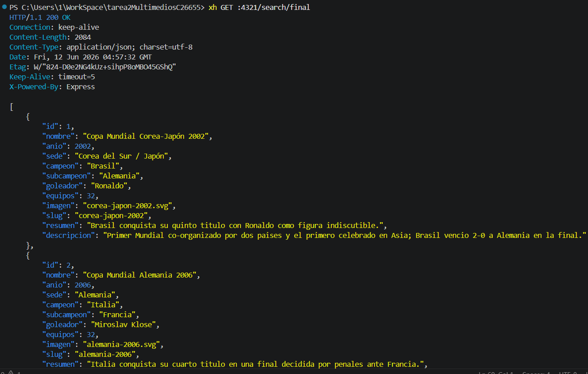
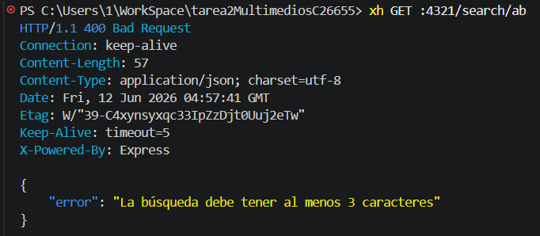

# API REST Copa Mundial FIFA

## Requisitos

- Node.js 20+
- pnpm

## Instalación

```bash
pnpm install
```

## Poblar la base de datos

```bash
pnpm run seed
```

## Ejecutar el servidor

```bash
pnpm dev
```

El servidor queda en `http://localhost:4321`.

## Rutas disponibles

| Ruta | Descripción |
|------|-------------|
| `GET /` | Información de la API |
| `GET /mundiales` | Lista de ediciones |
| `GET /mundiales?include=full` | Lista con todos los campos |
| `GET /mundial/:slug` | Detalle de una edición |
| `GET /campeon/:pais` | Ediciones ganadas por un país |
| `GET /random` | Edición aleatoria |
| `GET /search/:text` | Búsqueda (mín. 3 caracteres) |
| `GET /imagenes/:archivo` | Imagen de una edición |

## Pruebas con xh

```bash
xh GET :4321/mundiales
xh GET :4321/mundiales include==full
xh GET :4321/mundial/qatar-2022
xh GET :4321/mundial/inexistente    # -> 404 JSON
xh GET :4321/campeon/Argentina
xh GET :4321/random
xh GET :4321/search/final
xh GET :4321/search/ab              # -> 400 JSON (mínimo 3 caracteres)
```

## Capturas









